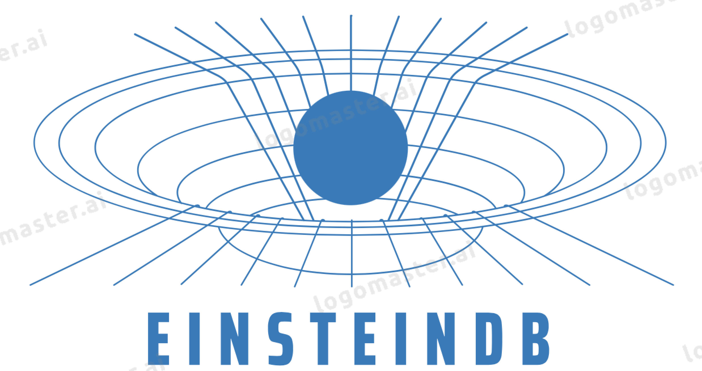

### Hybrid Index (Completed Overview)

EinsteinDB realizes the “Indexes are Models” principle by coupling a B+Tree-shaped page map with a learned CDF approximator that guides first-touch into the correct page range. The result is a two-phase access:

1. Model probe: approximate the target page using a learned-range estimator (CDF-like), minimizing index fanout.
2. Page refinement: use B+Tree page routing to land on exact leaf, then perform local search.

This hybrid scheme supports both point lookups and range scans efficiently while avoiding long, synchronous NVM writes.

#### Consistency & Crash Safety

- Ordered-write discipline ensures a durable happens-before relation between index entries and KV payloads.
- Relativistically linearizable semantics are achieved without a global clock by composing:
  - Causal sets (Causets) for logical ordering.
  - Lamport clocks for distributed event ordering across replicas.
  - VioletaBFT for byzantine-tolerant commit across nodes.

On recovery, pages and their differential segments are replayed in order, preserving index-key to value mapping invariants.

#### Depth-First, Bit-Precise Access & Block Cache

To accelerate path-following through index pages and their differential segments, EinsteinDB uses a DFS-friendly block cache:

- Vector-of-vectors block cache (see `src/block_cache.rs`) maintains hot pages in LRU order.
- DFS access patterns (from model probe to leaf) benefit from temporal locality; revisits are fast.
- The block cache stores opaque `Vec<u8>` page blocks keyed by page IDs, and evicts LRU upon capacity pressure.

This couples naturally with the CDF estimator: once a path is hinted, successive page touches remain cache-hot.

#### Range Scans

- Range scans begin at model-projected boundaries, then walk adjacent leaves.
- Block cache read-ahead can be layered to prefetch neighboring pages.
- The hybrid index retains hash-like point lookup speed and B+Tree range traversal efficiency.

#### KV Operations (Put/Get/Update/Delete/Scan)

- Put/Update/Delete:
  - Append a differential index record and payload, flush with ordered-write.
  - Periodic compaction merges differential segments back into base pages.
- Get:
  - Model probe → B+Tree refine → check differential overlay → return value.
- Scan:
  - Model-projected start → in-order leaf walk with optional prefetch via block cache.

This completes the high-level operational semantics of the hybrid design described above while preserving EinsteinDB’s crash consistency and distributed linearizability guarantees.



## [Website](https://www.einsteindb.com) | [Documentation](https://einsteindb.com/docs/latest/concepts/overview/) | [Community Chat](https://einsteindb.com/chat)

In a nutshell, EinsteinDB is a persistent indexing scheme based off of LSH-KVX that exploits the distinct merits of hash index and B+-Tree index to support range scan and avoids long NVM writes for maintaining consistency; thus improving on LSH’s performance guarantees for skewed data and adopts ordered-write consistency to ensure crash consistency, while retaining the same storage and query overhead. 

EinsteinDB is a hybrid memory system consisting of DRAM and Non-Volatile Memory(NVM) as its main components. The key-value store stores keys with their associated values in both DRAM and NVM. In addition, EinsteinDB builds an ordered set of differential concurrency schemes appended to a hash index in NVM to retain its inherent ability of fast index searching. 

- **Hybrid Index: Indexes Are Models**

Basic key-value operations include Put, Get, Update, Delete, and Scan. To locate the requested key-value item, the single-key operations (Put/Get/Update/Delete) first take exactly the B+tree index as a model that maps each query key to its page. For a sorted array, larger position id means larger key value, and the range index should effectively approximate the cumulative distribution function (CDF)one key to search the index. Once the KV item is located, Get directly returns the data, and while the write operations (Put/Update/Delete) require to persist updated index entry and new KV item if provided.

- **Differential concurrency**

As the number of CPU cores increases, concurrency control for heavy workloads becomes more challenging. Effective workload scheduling can greatly improve the performance by avoiding the conflicts. We introduce einst.ai, an AI4DB learned transaction management system compatible with EinsteinDB, FoundationDB, LevelDB, CockroachDB, and TiDB from two aspects: transaction prediction and transaction scheduling. einstAI predicts the future trend of different workloads

- **Hybrid Language Model s**

EinsteinDB supports declarative queries, which makes it easy to write queries without having to worry about how they're going to be executed. This also means that you can use EinsteinDB's constraint checking capabilities to ensure that your data is always consistent. EinsteinDB provides multi-dimensional spatial indexes, so you can perform geospatial queries on top of its columnar storage format. You can even combine this with time series data! These features make it well suited for mobile applications where users are querying historical data, such as their own location history or nearby points of interest.

--**Causets: 4-clique Causal cuts**--
A 4-clique cut (Information Theory Detour)separates processes into disjoint sets such that all edges within the set are potential causality relationships (happen before). The 4-clique cut can be computed in time linear to the number of nodes in the graph. The 4-clique cut provides us with an efficient way to reason about consistency in distributed systems. We’ve implemented our algorithms on top of einst.a.i and deployed them on Kubernetes for our production service MilevaDB, where we use it to provide upgrades with eventually consistent stores transformed by einst.a.i via GPT3 (OpenAI powers EinstAI) to convergent causal consistent 4-clique cuts of a Crown Graph.

--**Byzantine State Machine Replication for the Masses**--

VioletaBFT is a post-quantum asynchronous BFT protocol. This means that it uses the same cryptographic primitives as other classical BFT protocols, but with an additional set of constraints:

It guarantees liveness without making any timing assumptions. It ensures that no two processes can independently determine the outcome of the final state of the system. It does not require any coordination between process execution or synchronization among them to achieve this goal. If one process discovers that another process has violated their commitment, then they can undo their previous actions and rejoin at a later time when both processes are still in agreement, except for the period during which both nodes are in disagreement (in which case, only one node will be able to commit). The protocol guarantees consensus on every transaction committed by each node over its entire lifetime, including after failure at any point. This is possible because all nodes have full access to all other nodes' transactions and therefore know how many transactions exist before them and what order they were committed in. Since all nodes have full access to all other nodes' transactions, they can efficiently determine whether or not each other's commitments match up with theirs. All parties involved have complete knowledge about what the next state of the system will be before committing/receiving new information from outside sources such as external databases or external peers.


## Quick Start

EinsteinDB includes comprehensive deployment scripts and a working relativistic causal instance:

### Deployment Scripts

Bootstrap the environment and run the relativistic demo:

```bash
# Install Rust nightly toolchain and utilities
./scripts/bootstrap.sh

# Run the relativistic causal consistency demo
./scripts/run-demo.sh --release

# Try the server (falls back to demo if needed)
./scripts/run-server.sh --release

# Build specific packages
./scripts/build.sh --release --package einsteindb-prod

# Run tests
./scripts/test.sh --release

# Clean build artifacts and check unused dependencies
./scripts/prune.sh

# Format and lint code
./scripts/format-lint.sh
```

### Standalone Demo

For a quick demonstration without full workspace build:

```bash
rustc standalone_consistency_demo.rs && ./standalone_consistency_demo
```

The demo showcases:
- 3 distributed EinsteinDB nodes with Lamport timestamp coordination
- Causal event ordering and synchronization across nodes
- Relativistic analysis with lightlike/timelike separations
- Byte-level program structure analysis of the causal hierarchy

### Full Documentation

See [DEPLOYMENT.md](./DEPLOYMENT.md) for complete deployment instructions and configuration options.

## LRU Block Cache (Vector-of-Vectors)

EinsteinDB now includes a simple LRU block cache implemented as a vector-of-vectors for depth-first, bit-precise access patterns. See `src/block_cache.rs`.

Usage example:

```rust
use einsteindb_prod::block_cache::BlockCache;

let mut cache = BlockCache::new(1024); // capacity in blocks
cache.put(42, vec![0xde, 0xad, 0xbe, 0xef]);
let hit = cache.get(&42).unwrap();
assert_eq!(hit, &[0xde, 0xad, 0xbe, 0xef]);
```

Design notes:

- Keys and blocks are stored in parallel vectors; indices reflect recency (MRU at the tail).
- `touch()` moves accessed items to the tail. Eviction drops the head (LRU).
- Intentional O(n) index maintenance keeps the implementation compact and cache-friendly for moderate capacities. For production, a deque + hashmap or intrusive list can be substituted.

This cache provides a foundation for layering a block-based LRU over document or page-level indices, enabling DFS-friendly scans and improving spatial locality.

## CI/CD and Deployment

This repository includes GitHub Actions under `.github/workflows/rust.yml`. Pushing to your default branch will automatically run checks.

### Version Management

EinsteinDB uses semantic versioning with the following strategy:
- **Major versions** (x.0.0): Breaking changes to API or core architecture
- **Minor versions** (0.x.0): New features, performance improvements, additional components
- **Patch versions** (0.0.x): Bug fixes, documentation updates, minor improvements

Current version is tracked in `Cargo.toml` workspace manifest.

### Branching Strategy

- `main`: Production-ready code, protected branch
- `develop`: Integration branch for features
- `feature/*`: Individual feature development
- `hotfix/*`: Critical production fixes
- `release/*`: Release preparation branches

### Deployment Pipeline

1. **Development**: Work on feature branches, test locally with `./scripts/test.sh`
2. **Integration**: Merge to `develop`, run full test suite
3. **Release**: Create release branch, update version, comprehensive testing
4. **Production**: Merge to `main`, tag release, deploy

### Quick Deploy Commands

```bash
# Clean and prepare repository
./scripts/prune.sh

# Run full test suite
./scripts/test.sh --release

# Format and lint
./scripts/format-lint.sh

# Build release artifacts
./scripts/build.sh --release

# Commit and push changes
git add .
git commit -m "feat: deploy relativistic causal instance with comprehensive tooling"
git push origin main
```

### Container Deployment

Use the included `docker/Dockerfile` for containerized deployment:

```bash
docker build -f docker/Dockerfile -t einsteindb:latest .
docker run -p 8080:8080 einsteindb:latest
```


## License

EinsteinDB is under the Apache 2.0 license. See the [LICENSE](./LICENSE) file for details.

